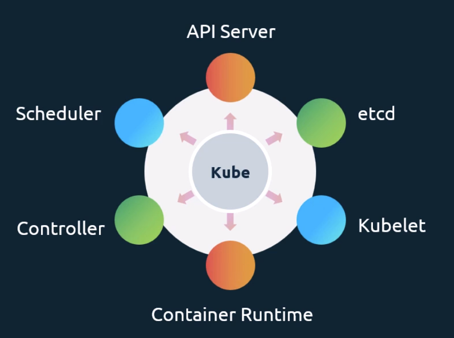

# Kubernetes Fundamentals

## Container Orchestration

- After packaging applications into containers, the next step is running them in production. This involves managing dependencies on other containers (such as databases or messaging services), scaling up to handle increased user load, and scaling down when demand decreases. To achieve this, you need a platform that orchestrates connectivity between containers and automatically adjusts scaling based on load. This automated process of deploying and managing containers is known as container orchestration.

- Common Tools:

    1. Kubernetes
    1. Docker Swarm
    1. Mesos
    1. Hashicorp Nomad

## Kubernetes Architecture

- ***API Server***:  The API server acts as the front-end for kubernetes. The users, management devices, Command line interfaces all talk to the API server to interact with the kubernetes cluster.

- ***etcd***: ETCD is a distributed reliable key-value store used by kubernetes to store all data used to manage the cluster. Think of it this way, when you have multiple nodes and multiple masters in your cluster, etcd stores all that information on all the nodes in the cluster in a distributed manner. ETCD is
responsible for implementing locks within the cluster to ensure there are no conflicts
between the Masters.

- ***Scheduler***: The scheduler is responsible for distributing work or containers across multiple
nodes. It looks for newly created containers and assigns them to Nodes. 

- ***Controllers***: The controllers are the brain behind orchestration. They are responsible for noticing
and responding when nodes, containers or endpoints goes down. The controllers makes decisions to bring up new containers in such cases.

- ***Container Runtime***: The container runtime is the underlying software that is used to run containers.**containerd** is one of the most common runtimes used in Kubernetes clusters.

- ***kubelet***: kubelet is the agent that runs on each node in the cluster. The agent is responsible for making sure that the containers are running on the nodes as expected.

- ***Container Runtime Interface - CRI*** : 

    - The CRI is a plugin interface which enables the kubelet to use a wide variety of container runtimes, without having a need to recompile the cluster components.
    - You need a working container runtime on each Node in your cluster, so that the kubelet can launch Pods and their containers.The Container Runtime Interface (CRI) is the main protocol for the communication between the kubelet and Container Runtime.
    - The Kubernetes Container Runtime Interface (CRI) defines the main gRPC protocol for the communication between the node components kubelet and container runtime.
    - `crictl` is the K8S CRI command line utility that works on all worker nodes irrespective of the container runtimes like containerd,cri-o etc.